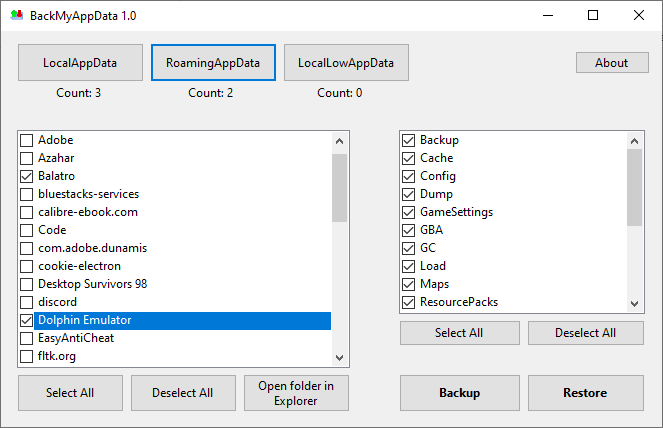

# BackMyAppData

BackMyAppData is a simple app that can create and restore backups of the "AppData" folders on a Windows machine, which contain the data and settings of the majority of the apps on the computer, which may be important to be managed.

.NET 8 is required to be able to run the app.

# Where do I install it?

Every release is available under the, well, releases page, accessible through the sidebar. (or you can click [here](github.com/ExFabian/BackMyAppData/releases))

# Building

For building the app yourself or for contributing, I highly recommend using Visual Studio 2022 or above and opening the solution file. This is a C# WinForms app which makes use of the Designer functions available in Visual Studio.  
.NET 8 is also required for building the app.

# Obligatory AI statement

This project contains no AI generated code, as this project started as a way for me to exercise my C# skills.  
I request any eventual contributors to keep AI generated code to a minimum.

